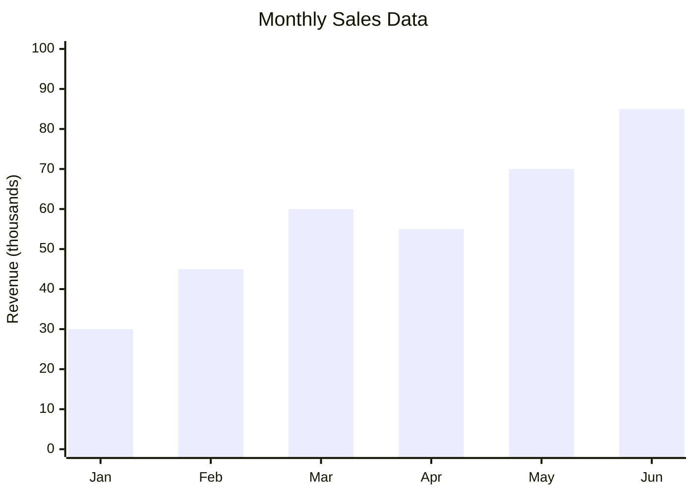
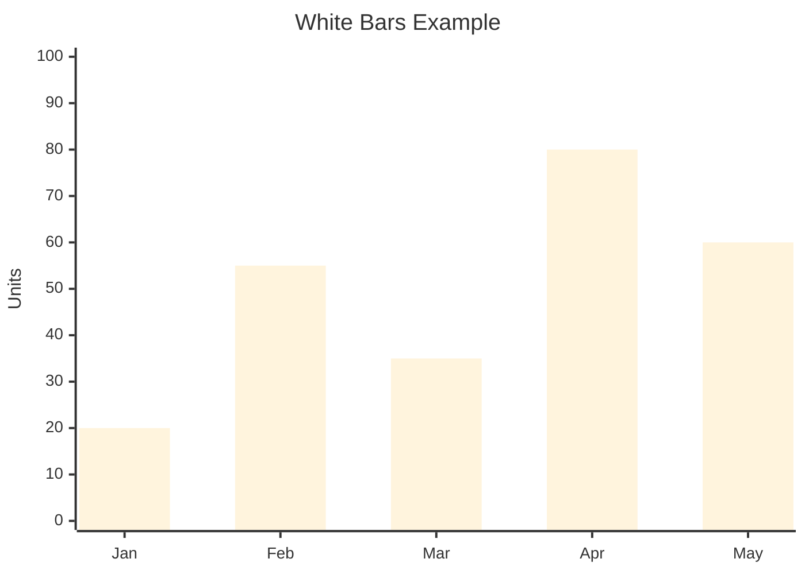

# Mermaid Diagram Gallery

A showcase of Mermaid diagram types.

---

## XY Chart

```mermaid
---
config:
    xyChart:
        backgroundColor: transparent
        plotColorPalette: "#ffffff"
---
xychart-beta
    title "Monthly Sales Data"
    x-axis [Jan, Feb, Mar, Apr, May, Jun]
    y-axis "Revenue (thousands)" 0 --> 100
    bar [30, 45, 60, 55, 70, 85]
```

```mermaid
%%{init: {
  "theme": "base",
  "themeVariables": {
    "background": "transparent"
  }
}}%%
xychart-beta
  title "White Bars Example"
  x-axis ["Jan","Feb","Mar","Apr","May"]
  y-axis "Units" 0 --> 100
  bar [20, 55, 35, 80, 60]
```